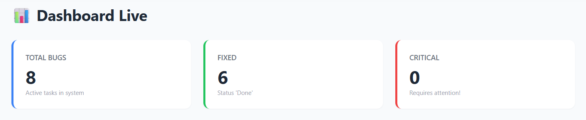
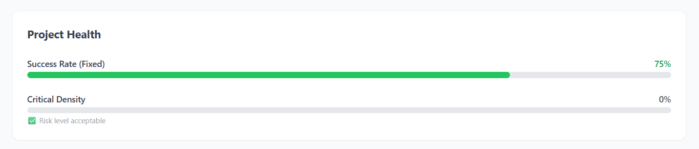
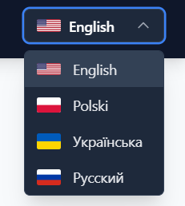

# 🛡️ QA Task Manager

### A modern, interactive dashboard for tracking software quality assurance metrics, managing bugs, and analyzing project health.



## 📋 About The Project

**QA Task Manager** is a specialized tool designed for QA Leads and Testers. It provides a real-time overview of the testing process, visualizes critical data through interactive charts, and helps teams make data-driven decisions.

This project was built as a Student Project (2026) to demonstrate modern frontend development practices using React ecosystem.

## ✨ Key Features

* **📊 Interactive Analytics:** Visual breakdown of bugs by Priority and Status using `Recharts`.
* **🩺 Project Health Metrics:** Real-time calculation of Success Rate and Critical Density with automated risk assessment.
* **⚡ Activity Feed:** Live stream of recent actions and bug updates.
* **🌍 Internationalization (i18n):** Full support for **English, Polish, Ukrainian, and Russian** with a custom flag selector.
* **🚀 Smooth UX:** Page transitions powered by `Framer Motion`, sticky navigation, and "Scroll to Top" functionality.
* **🐞 Bug Tracker:** Interface for creating, tracking, and filtering software issues.

## 📸 Screenshots

### 📊 KPI & Health Metrics
Monitor the pulse of your project with visual progress bars and risk indicators.


### 🌍 Localization
Seamless switching between languages with a custom UI component.


## 🛠️ Tech Stack

* **Core:** React.js (Hooks, Context API)
* **Styling:** Tailwind CSS
* **Charts:** Recharts
* **Animations:** Framer Motion
* **Routing:** React Router v6
* **Assets:** React World Flags

## 🚀 Getting Started

To run this project locally, follow these steps:

### Prerequisites
* Node.js (v14 or higher)
* npm

### Installation

1.  **Clone the repository**
    ```bash
    git clone [https://github.com/YOUR_USERNAME/qa-task-hub.git](https://github.com/YOUR_USERNAME/qa-task-hub.git)
    ```

2.  **Navigate to project directory**
    ```bash
    cd qa-task-hub
    ```

3.  **Install dependencies**
    ```bash
    npm install
    ```

4.  **Start the application**
    ```bash
    npm start
    ```
    The app will run at `http://localhost:3000`.


---
© 2026 QA Task Manager. All Rights Reserved.