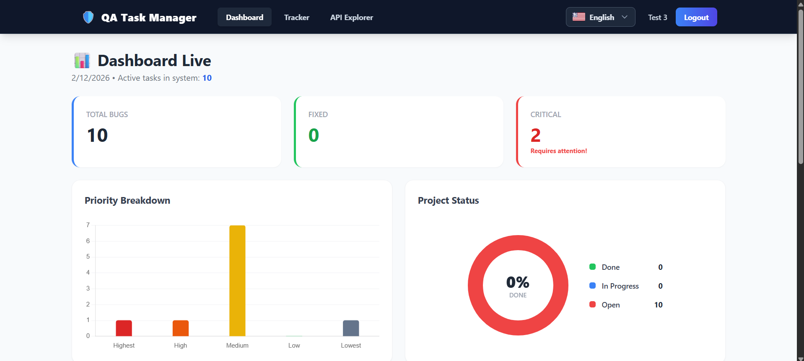
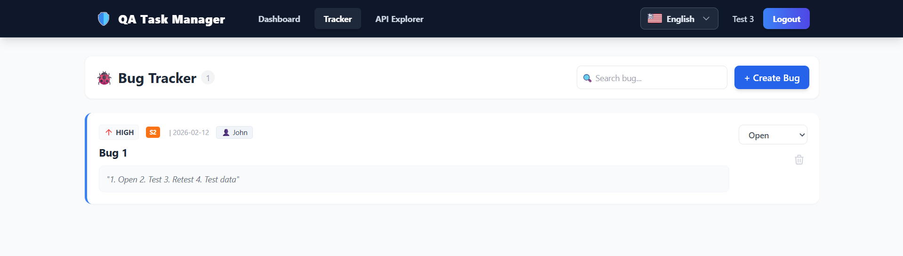
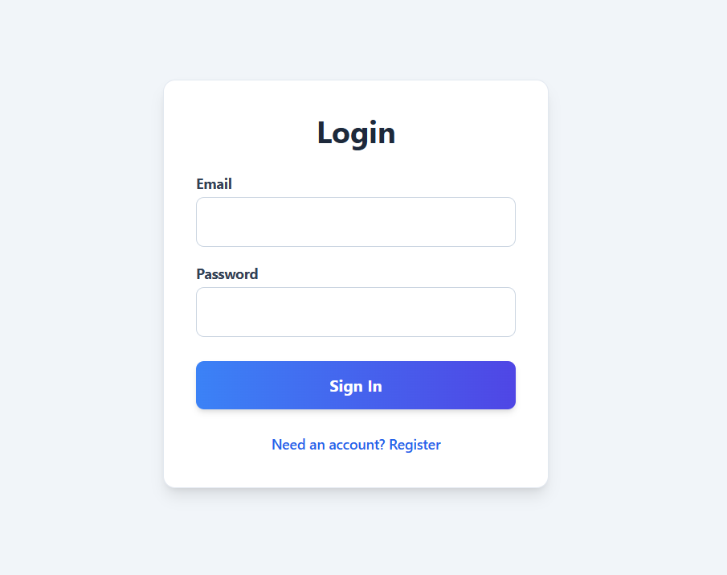
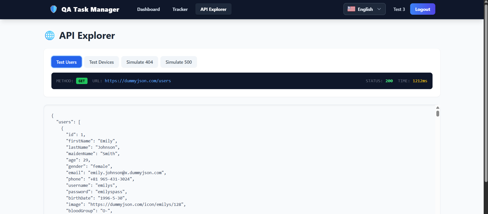

# QA Task Manager

**QA Task Manager** is a full-stack web application designed for tracking software quality assurance metrics, managing bug lifecycles, and visualizing project health data. The system utilizes a React-based frontend for the user interface and a Node.js/Express backend with SQLite for persistent data storage.

The entire application is strictly typed using **TypeScript**, ensuring highly reliable code, predictable data models, and a robust developer experience. It implements a decoupled client-server architecture with stateless authentication via JSON Web Tokens (JWT), ensuring secure and scalable user session management.

---

## Technical Architecture

The project follows a professional **Controller-Service-Repository** pattern, utilizing strictly typed classes and dependency-ready logic.

### 1. Frontend (Client)
* **Framework:** React.js (v18) with TypeScript, utilizing Functional Components and Hooks.
* **Routing:** React Router DOM (v6) for client-side navigation and protected route management.
* **State Management:** React Hooks (useState, useEffect, useCallback) for local state and global user session handling.
* **Visualization:** Chart.js and React-Chartjs-2 for rendering statistical graphs (Bar, Doughnut).
* **UI/UX:** Tailwind CSS for utility-first styling and Framer Motion for interface transitions.
* **Internationalization:** Custom i18n implementation supporting English, Polish, Ukrainian, and Russian.

### 2. Backend (Server)
* **Architecture:** Class-based OOP with BaseController and BaseService abstractions for maximum code reuse.
* **Runtime:** Node.js with TypeScript (`ts-node` for development, `tsc` for production).
* **Framework:** Express.js for handling HTTP requests and class-based middleware integration.
* **Database:** SQLite (file-based) using a **Singleton Database Class** to ensure single-connection persistence.
* **Authentication:** * **JsonWebToken (JWT):** Generates signed tokens with embedded user roles.
    * **Bcrypt.js:** Implements cryptographic salting and hashing for password storage.
* **Security & Validation:** Joi (strict payload validation), Helmet (HTTP headers protection), Express Rate Limit (DDoS prevention).
* **Middleware:** Class-based `AuthGuard`, `ValidationMiddleware`, and `SecurityPolicy` for centralized access control.

### 3. Data Flow
1.  **Request:** Client sends HTTP request with `Authorization: Bearer <token>` header (for protected routes).
2.  **Verification:** Middleware verifies the JWT signature and extracts user identity.
3.  **Execution:** Controller processes the request, applies business/security logic, and interacts with the SQLite database.
4.  **Response:** Server returns JSON data to the client.

### 4. Automated Testing
* **Framework:** Jest and Supertest for integration testing.
* **Coverage:** **89.11% Line Coverage** across the entire backend API.
* **Strategy:** Endpoint-grouped test suites covering 15+ scenarios (Positive, Negative, and Security/IDOR).

---

## Security Features Implemented

* **Strict TypeScript Interfaces:** End-to-end type safety preventing payload mismatches and runtime errors.
* **JWT Authentication:** Secure token-based authentication with role-based claims (Admin vs User).
* **IDOR Protection (SecurityPolicy):** Class-based middleware ensuring users can only edit or delete bugs belonging to their specific JWT identity.
* **Admin Override:** Role-based logic allowing administrators to bypass standard ownership restrictions for project management.
* **Input Sanitization:** Automated Joi validation prevents malformed data and potential injection vectors.

---

## Database Schema

The application uses a relational database structure with a **Singleton Database class** for async/await execution.

### Table: users
| Column | Type | Constraint | Description |
| :--- | :--- | :--- | :--- |
| `role` | TEXT | DEFAULT 'user' | Access level for RBAC (user/admin). |
| `id` | INTEGER | PRIMARY KEY | Auto-incrementing unique identifier. |
| `email` | TEXT | UNIQUE, NOT NULL | User login credential. |
| `password` | TEXT | NOT NULL | Hashed password string (bcrypt). |
| `name` | TEXT | NOT NULL | Display name of the user. |

### Table: bugs
| Column | Type | Constraint | Description |
| :--- | :--- | :--- | :--- |
| `userId` | INTEGER | FOREIGN KEY | ID of the user who owns this bug. |
| `id` | INTEGER | PRIMARY KEY | Auto-incrementing unique identifier. |
| `title` | TEXT | NOT NULL | Summary of the defect. |
| `priority` | TEXT | NOT NULL | Level: Highest, High, Medium, Low, Lowest. |
| `severity` | TEXT | NOT NULL | Impact: Critical (S1), Major (S2), Moderate (S3), Low (S4). |
| `status` | TEXT | DEFAULT 'Open' | Workflow state: Open, In Progress, Done. |
| `assignee` | TEXT | OPTIONAL | Name of the team member assigned. |
| `date` | TEXT | NOT NULL | ISO 8601 formatted date string. |

---

## Application Previews

| Dashboard Analytics | Bug Tracker Interface |
|---------------------|-----------------------|
|  |  |

| Authentication | API Explorer |
|----------------|--------------|
|  |  |

---

## API Documentation

The backend exposes a RESTful API running on port `5000`.

### Authentication
| Method | Endpoint | Description | Auth Required |
|:--- |:--- |:--- |:--- |
| **POST** | `/auth/register` | Registers a new user account and encrypts credentials. | No |
| **POST** | `/auth/login` | Authenticates user and returns JWT with role-based claims. | No |

### Bug Management
| Method | Endpoint | Description | Auth Required |
|:--- |:--- |:--- |:--- |
| **GET** | `/bugs` | Retrieves the list of bug reports owned by the authenticated user. | Yes |
| **POST** | `/bugs` | Creates a new bug report bound to the user's unique identity. | Yes |
| **PUT** | `/bugs/:id` | Updates bug details; restricted to Owner or Admin role. | Yes |
| **DELETE** | `/bugs/:id` | Removes a bug report; restricted to Owner or Admin role. | Yes |

---

## Installation and Setup

**Prerequisites:** Node.js (v18+) and npm.

### 1. Clone the Repository
```bash
git clone [https://github.com/YOUR_USERNAME/qa-task-manager.git](https://github.com/YOUR_USERNAME/qa-task-manager.git)
cd qa-task-manager
```

---

### 2. Backend Configuration
```bash
cd backend
npm install
npm run test           # Run automated test suite
npm run test:coverage  # View code coverage report
npm run dev            # Start development server
```

---

### 3. Frontend Configuration
```bash
cd frontend
npm install
npm start
```